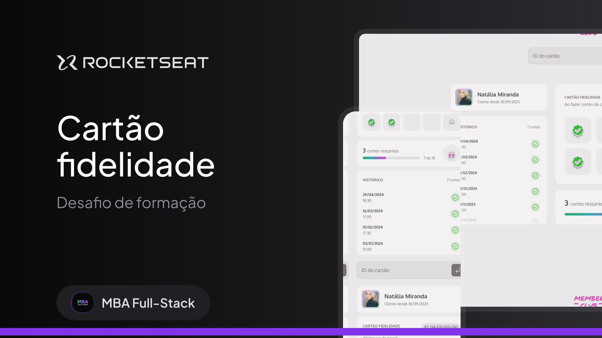

## Projeto cartão fidelidade

<a href="https://www.figma.com/community/file/1380913092616830278">Link do projeto no figma</a>

### Sobre

Este projeto é um desafio do **MBA Full Stack da Rocketseat** em parceria com a **Sirius**. O intuiuto é desenvolver o front-end de uma aplicação de cartão fidelidade. O back-end vai ser simulado através do json-server.

Foi fornecido o layout do aplicativo no **Figma** e deve ser gerado o HTML, Javascript e CSS do layout de forma **responsiva**.

### Tecnologias

- Figma
- HTML5
- CSS3
- Javascript (para acessar o back-end  através da fetch API).

### Requisitos Funcionais

[x] Deve ser possível buscar as informações dos clientes através de um ID;

[x] Deve haver uma validação pra saber se é um ID válido e existente;

[x] Deve aparecer um alerta de erro em tela caso seja um ID inválido;

Tendo sucesso em trazer os dados de cada cliente:

[x] Deve ser exibida na tela a imagem do(a) cliente;

[x] Deve ser exibido na tela o nome do(a) cliente;

[x] Deve ser exibido na tela o histórico de cortes com a quantidade, a data e a hora;

[x] Deve ter um check no cartão fidelidade para cada corte de cabelo que o(a) cliente tiver;

[x] Deve ser exibido na tela um progresso com o número de cortes restantes para o prêmio;

[x] Deve aparecer na tela um modal de parabéns com a mensagem: “Parabéns! Seu próximo corte é gratuito!” caso o cliente tenha atingido os 10 cortes;